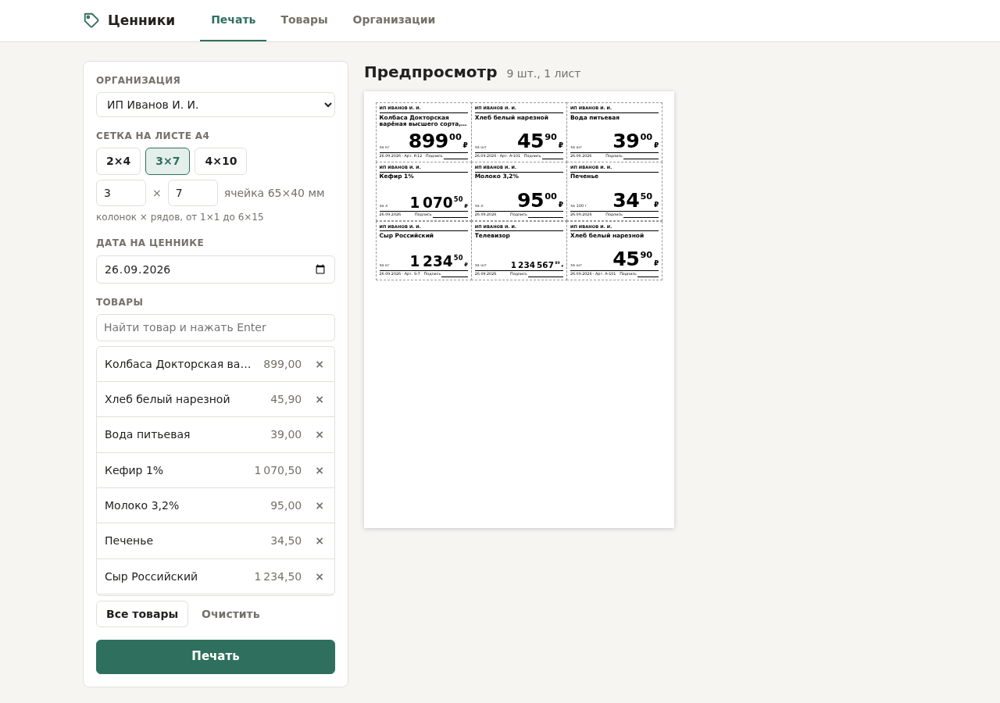
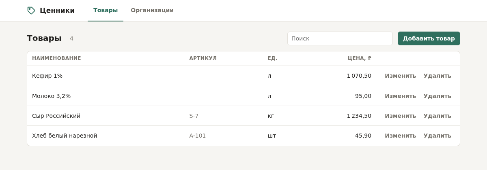

# price-tags



**price-tags** — служба для печати ценников в магазине. Ведёт справочники организаций и товаров с ценами и
печатает ценники на листах A4 из браузера.

## Возможности

- Вкладка «Печать» (открывается по умолчанию): выбор организации, товаров и сетки на листе A4, дата на
  ценнике, предпросмотр листов и печать из браузера.
- Вкладки «Товары» и «Организации» (ссылки `…/#products`, `…/#orgs`): таблица с поиском, добавление и правка
  строки на месте (Enter сохраняет, Esc отменяет, двойной щелчок по строке открывает правку), удаление с
  подтверждением.
- Цена вводится в рублях (`45,90`, `1 070.5`) и хранится в копейках.
- Светлая и тёмная тема по настройке системы.
- JSON API справочников.

## Печать ценников

Ценник содержит название организации, наименование товара (до двух строк), цену, единицу измерения («за кг»),
дату, артикул (если указан) и строку для подписи. Ячейки обведены пунктиром для резки.

Сетка задаётся числом колонок и рядов: готовые варианты 2×4 (8 ценников на листе), 3×7 (21) и 4×10 (40)
или вручную от 1×1 до 6×15. Размер ячейки показывается рядом (поле листа 8 мм). Шрифты масштабируются под
размер ячейки, длинные цены уменьшаются, чтобы поместиться. Если товаров больше, чем ячеек, получается
несколько листов.

Товар добавляется в список поиском по наименованию или артикулу (стрелки и Enter) или кнопкой «Все товары».
Выбранные организация, сетка и список товаров запоминаются в браузере.

В диалоге печати браузера нужно выбрать масштаб 100% («Фактический размер»), иначе размеры ценников
изменятся. Колонтитулы браузера (адрес, дата) лучше отключить.



## Хранение данных

Справочники организаций и товаров хранятся в одном JSON-файле (`data_file` в конфигурации):

```json
{
  "version": 1,
  "next_id": 4,
  "organizations": [{"id": 1, "name": "ИП Иванов И. И."}],
  "products": [{"id": 2, "name": "Хлеб белый", "unit": "шт", "article": "A-1", "price_kop": 4590}]
}
```

Организация нужна только для заголовка ценника, справочник товаров общий. Цена хранится целым числом копеек,
чтобы не было ошибок округления. Идентификаторы общие для обоих справочников и после удаления записи повторно
не выдаются.

Каждое изменение сразу записывается на диск атомарно: во временный файл `<data_file>.tmp`, затем `fsync` и
`rename`. Сбой во время записи не портит файл. Если файла нет, справочники пусты; если файл испорчен, служба
не запускается и файл не трогает.

## JSON API

| Метод и путь | Действие | Ответ |
|---|---|---|
| `GET /api/organizations` | список организаций | 200, массив |
| `POST /api/organizations` | добавить организацию `{"name": "..."}` | 201, запись с `id` |
| `PUT /api/organizations/{id}` | изменить организацию | 200, запись |
| `DELETE /api/organizations/{id}` | удалить организацию | 204 |
| `GET /api/products` | список товаров | 200, массив |
| `POST /api/products` | добавить товар `{"name", "unit", "price_kop", "article"}` | 201, запись с `id` |
| `PUT /api/products/{id}` | изменить товар | 200, запись |
| `DELETE /api/products/{id}` | удалить товар | 204 |

`article` необязателен, `id` в теле `PUT` игнорируется (берётся из пути). Ошибки возвращаются как
`{"error": "текст"}`: 400 для некорректных данных, 404 если записи нет, 413 если тело запроса больше 64 КБ,
500 если не удалось сохранить файл.

```bash
curl -X POST http://127.0.0.1:8082/api/products -d '{"name": "Хлеб белый", "unit": "шт", "price_kop": 4590}'
```

Авторизации нет: изменить справочники может любой, кто достаёт до порта. Если страница нужна только на
этом компьютере, укажите в конфигурации `"listen_addr": "127.0.0.1"`.

## Требования

### Для сборки

- CMake 3.25+
- компилятор с поддержкой C++20 (GCC 12+)
- `fmt`
- `nlohmann-json`
- `googletest` и `googlemock` — только для тестов

[cpp-httplib](https://github.com/yhirose/cpp-httplib) v0.18.7 встроен в проект (`third_party/httplib`),
`fmt` подключается в header-only режиме: во время работы нужны только системные библиотеки C/C++.

Debian 13:

```bash
apt install -y build-essential cmake dpkg-dev libfmt-dev nlohmann-json3-dev libgtest-dev libgmock-dev
```

## Сборка из исходников

```bash
cmake -S . -B build -DCMAKE_BUILD_TYPE=Release -DCMAKE_INSTALL_PREFIX=/usr
cmake --build build -j$(nproc)
ctest --test-dir build
```

Тесты можно не собирать: `-DBUILD_TESTS=OFF`.

## Запуск

```bash
./build/price-tags configuration/cfg.json
```

Единственный аргумент — путь к конфигурации, по умолчанию `/etc/price-tags/cfg.json`.
Страница доступна по адресу `http://<хост>:8082/`.

## Конфигурация

| Поле | По умолчанию | Описание |
|---|---|---|
| `listen_addr` | `0.0.0.0` | адрес HTTP-сервера |
| `port` | `8082` | порт HTTP-сервера |
| `log_level` | `6` | уровень syslog (0-7) |
| `data_file` | `/var/lib/price-tags/catalog.json` | файл справочников |

## Сборка DEB

Пакет собирается через CPack. Собирать нужно на той же системе (или в контейнере с ней), куда пакет будет
устанавливаться: зависимости от `libc6` и `libstdc++6` подставляются по версиям сборочной системы.

```bash
cmake -S . -B build -DCMAKE_BUILD_TYPE=Release -DCMAKE_INSTALL_PREFIX=/usr -DBUILD_TESTS=OFF
cmake --build build -j$(nproc)
cd build && cpack -G DEB
apt install -y ./price-tags_<версия>_amd64.deb
```

После установки будут размещены:

- бинарник: `/usr/bin/price-tags`
- конфигурация: `/etc/price-tags/cfg.json` (conffile — при обновлении пакета правки не затираются)
- unit systemd: `/usr/lib/systemd/system/price-tags.service`
- лицензия: `/usr/share/doc/price-tags/copyright`

Служба работает от динамического пользователя без привилегий, справочники хранятся в `/var/lib/price-tags`
(каталог создаёт systemd). При удалении пакета, в том числе с `purge`, справочники не удаляются.

## Релизы

Сборка настроена в GitHub Actions (`.github/workflows/release.yml`): на каждый push и pull request в `master`
проект собирается в контейнере Debian 13, прогоняются тесты и собирается DEB-пакет. Чтобы выпустить релиз,
нужно поставить тег `v<версия>`, совпадающий с версией в `CMakeLists.txt`, и отправить его:

```bash
git tag v0.1.0.0
git push origin v0.1.0.0
```

## Лицензия

GPL-3.0-or-later, см. [LICENSE](LICENSE). cpp-httplib распространяется по лицензии MIT.
